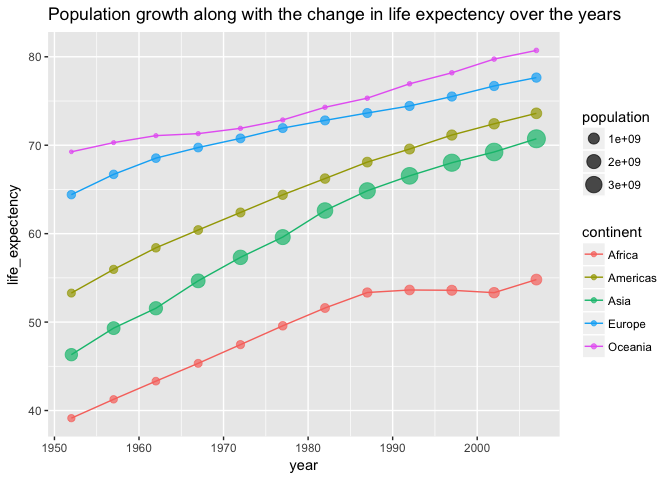
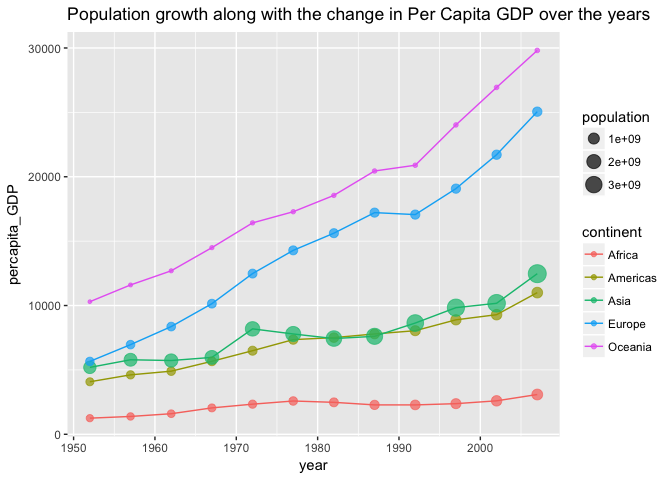
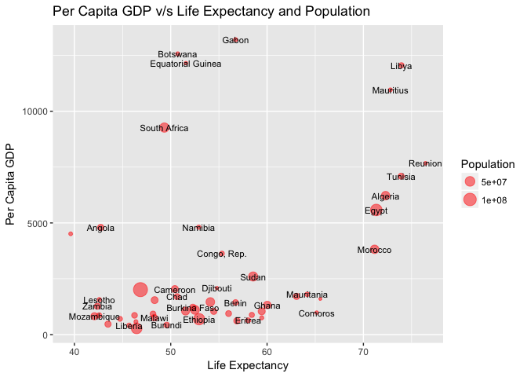
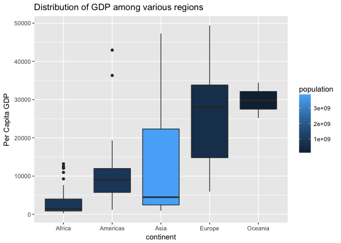
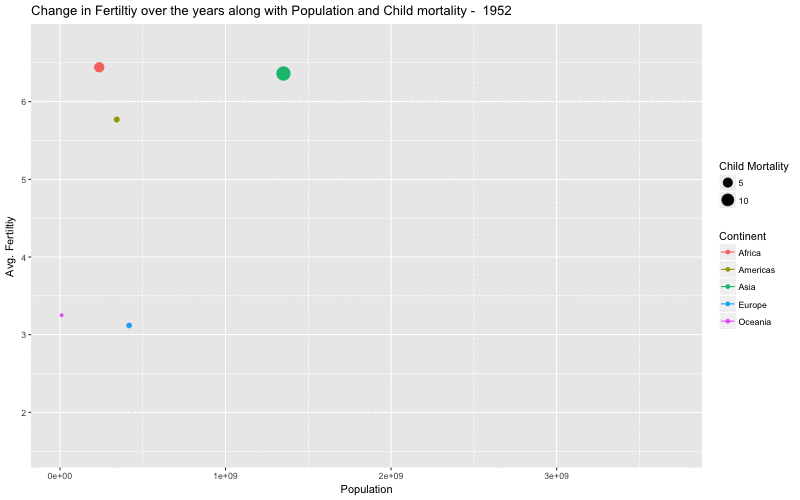

Exploratory Data Analysis - Gapminder Dataset
================
Suhas Hegde
9/19/2017

Gapminder and the "Gapminder dataset"
-------------------------------------

-   ["Gapminder"](https://www.gapminder.org) is a non-profit organisation concentrated on educating people about fact based information

-   Based out of Sweden

-   Promotes fact based view of the world

-   [The dataset](https://www.gapminder.org/data/) contains data about life-expectancy, GDP, population of all the countries in the world beginning from 1952 till 2007

Exploratory graphs
------------------

-   The visualizations were created using the "ggplot2" package available in the R-language

-   They try to identify various trends in population, life-expectancy etc.

-   Relationship between various factors such as GDP, child mortality, population rise, number of children per person etc. are explored in these time-series visualizations

-   Aesthetics such as color, size, shape etc. are used to indicate different factors in a single visualization to enhance the amount of information given out

Population growth, change in life expectancy, GDP growth, fertility etc.
------------------------------------------------------------------------

-   Popular belief is that world's population is growing indiscriminately and the poor are becoming more poor

-   The data shows that population growth has tapered off in the last decade and the GDP of the so called "poor countries" are going up

-   Next few visualizations show the change in various socio-economic factors over the years

-   The last plot shows that the population of the world has grown, but from the sizes of the points from 1990-2000's we can determine that it is not growing exponentially anymore

-   The life expectancy of the people of the world is steadily going up, even for people in the African countries

-   Even among the African and Asian countries there is a wide spread gap and only some countries do far worse than others in terms of these measures

-   The next table illustrates the same

Top and Bottom countries interms of life expectancy
---------------------------------------------------

    ## # A tibble: 10 x 6
    ## # Groups:   continent [5]
    ##        country continent  year lifeExp       pop  gdpPercap
    ##         <fctr>    <fctr> <int>   <dbl>     <int>      <dbl>
    ##  1   Swaziland    Africa  2007  39.613   1133066  4513.4806
    ##  2 Afghanistan      Asia  2007  43.828  31889923   974.5803
    ##  3       Haiti  Americas  2007  60.916   8502814  1201.6372
    ##  4      Turkey    Europe  2007  71.777  71158647  8458.2764
    ##  5     Reunion    Africa  2007  76.442    798094  7670.1226
    ##  6 New Zealand   Oceania  2007  80.204   4115771 25185.0091
    ##  7      Canada  Americas  2007  80.653  33390141 36319.2350
    ##  8   Australia   Oceania  2007  81.235  20434176 34435.3674
    ##  9     Iceland    Europe  2007  81.757    301931 36180.7892
    ## 10       Japan      Asia  2007  82.603 127467972 31656.0681

-   The last visualization shows that despite the growth in population GDP can still go up

-   Asia with close to 50% of world's population still has seen a GDP growth in most countries

-   Africa is the only continent which hasn't seen a good growth in GDP, but that is for the whole continent and individual countries differ a lot

-   The difference in the GDP between the top and the bottom countries in Africa can be seen in the next visualization

-   As we can see from the last graph GDP is is not uniformly distributed in various regions of the world

-   Even regions such as Africa and Asia have countries with very high GDP that are outliers

-   America's(the South and the North) have some countries such as USA and Canada that have high GDP but they also have very low lying countries such as Haiti and Bolivia

-   We will look at two more factors that seem to affect the population growth, child mortality and the number of children per women

-   These sociological factors seem to have an effect on the growth of population

-   As soon as the number of children who are dying at an early age reduces, the fertility rate goes down and thus the rate at which the population grows in a region

-   The next animated visualization will show the decline in fertility rate across all regions over the years

-   The last animated graph shows that fertility has been going down irrespective of population growth

-   Even people in Africa are having less children than what they used to have 50 years ago

-   Child mortality plays a huge role in how many children are born per women, as child mortality decreases so does the fertility

Conclusion
----------

-   A lot of the rhetoric's we hear today on general news media are outdated and are not according to the data(Even with data that is 10 years old we were able to prove that it is difficult to divide the world into two categories)

-   It is useful to collect socio-economic data on a large scale and to make policy decisions based on them

-   Africa and Asia, two continents that are termed as backward constantly are not that easy to put into a single category

-   The spread of GDP is wide and it varies even within individual countries
